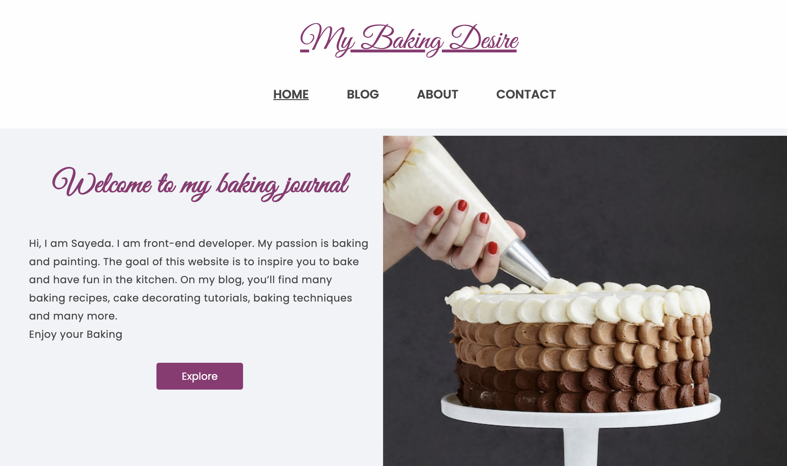

## My baking desire

 </a>

- My Baking Desire is a baking blog that I created as part of my Year 1 exam project.

## Description

My baking desire was a exam assignment which was developed with HTML, CSS and JavaScript. The website was implemented WordPress.

The following steps were used during development:

- Adobe XD was used for designing the website.
- The design was tested using Adobe XD prototype.
- The website was created using HTML , CSS and Javascript
- A WordPress installation was made.
- Hotjar was used for usability testing.

<a href="https://poetic-dusk-59ba87.netlify.app/">My baking Desire</a>

## Built With

- HTML
- CSS
- Javascript

## CMS

- WordPress REST API

## Designed with

- AdobeXD

## Getting Started

### Installing

- Download the zip of the project or clone the repo :

https://github.com/Noroff-FEU-Assignments/project-exam-1-sayeda-chattopadhyay.git

### Running

- Open in Visual Studio Code and use the Live Server Preview extension to view the site.

## Contributing

- Any suggestions and feedback are welcome.

## Contact

[My Gmail](mailto:sayeda.b@gmail.com)

[My LinkedIn page](https://www.linkedin.com/in/sayeda-chattopadhyay-7b33ba156/)

[My Behance page](https://www.behance.net/gallery/111339401/UX-Portfolio)

## License

Copyright (c) 2022 Sayeda Chattopadhyay
